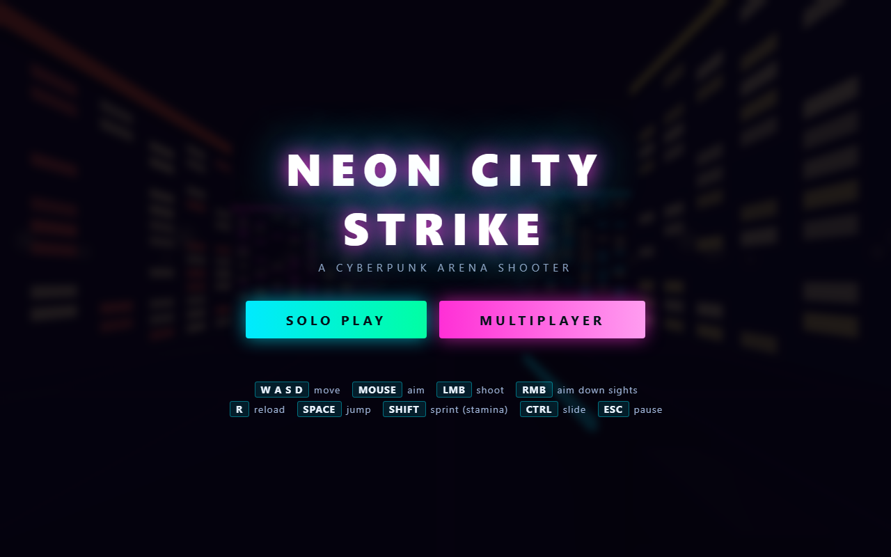

# NEON CITY STRIKE

<div align="center">

[فارسی](README.md) · **English**




</div>

A **cyberpunk arena shooter** that fits in **one HTML file** — nothing to install, no server,
no internet required. The whole game (including the three.js engine and the PeerJS networking
library) is inlined, and it makes no outbound requests.

> **▶ [Play it in the browser](https://ekkh1300.github.io/neon-city-strike/)** — no install, no download

---

## Run it

**Double-click** [`index.html`](index.html). That is the whole setup.

For **multiplayer** you should serve the file over `https://` or `localhost`, because WebRTC is
restricted in insecure contexts:

```bash
python -m http.server 8000
# then open: http://localhost:8000
```

---

## Features

- **Endless waves** — each one harder, with a countdown and escalating pressure
- **Four weapons** with real stats (damage, magazine, fire rate, spread, recoil, range, ADS zoom):

  | Weapon | Damage | Mag | Range | Sweet spot |
  |---|---|---|---|---|
  | `VIPER .45` | 34 | 12 | 120 | Cheap, accurate taps |
  | `HORNET SMG` | 14 | 32 | 80 | Sustained fire, crowd control |
  | `JUDGE-12` | 11 × 8 | 6 | 35 | One-shot up close, heavy recoil |
  | `LONGSHOT-50` | 110 | 5 | 250 | Long-range one-taps, 24° zoom |

- **Two modes** — `SOLO PLAY` and `MULTIPLAYER` with create/join room (room code)
- **Simulated movement** — sprinting with **stamina**, jumping, and sliding
- **Tactical HUD** — health, stamina, ammo + reserve, reload bar, hitmarker, dynamic crosshair
- **Weapon select on every respawn** (`CHOOSE YOUR WEAPON`), plus score, time, kills and death screen
- **Mobile controls** — left stick to move, drag on the right to look/aim, on-screen action buttons
- **Adaptive touches** — "rotate your device" prompt on mobile, pause on `ESC`

---

## Controls

| Key | Action |
|---|---|
| `W A S D` | Move |
| `MOUSE` | Aim |
| `LMB` | Fire |
| `RMB` | Aim down sights |
| `R` | Reload |
| `SPACE` | Jump |
| `SHIFT` | Sprint (drains stamina) |
| `CTRL` | Slide |
| `ESC` | Pause |

**Mobile:** left stick = move · drag on the right = look · `FIRE` / `ADS` / `RELOAD` / `RUN` /
`SLIDE` / `JUMP` buttons

---

## Layout

```
index.html   the whole game: HTML + CSS + JS + three.js + PeerJS (one file, ~815KB)
preview.png  menu screenshot
```

## Notes

- Runs in any mobile browser and ships with full-screen support (`mobile-web-app-capable`)
- Multiplayer uses the **PeerJS cloud**, so that mode does need an internet connection
